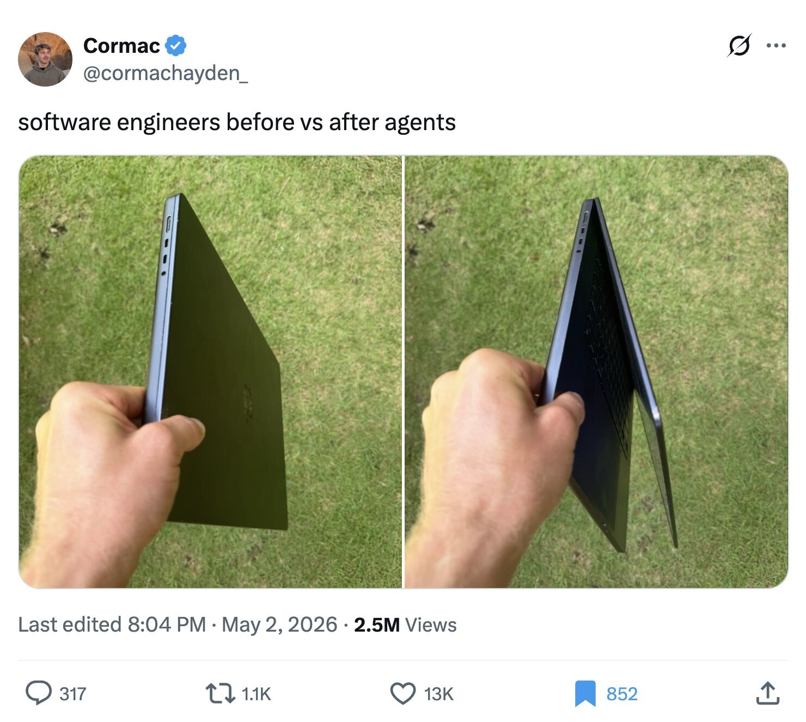

# Don't Sleep

A tiny macOS menu bar app that keeps your MacBook awake when the lid is closed.

<p align="center">
  
</p>

<p align="center">
  <em>Closed enough to save pixels. Awake enough to keep the job running.</em><br>
  <em>닫힌 척은 하되, 일은 계속.</em>
</p>

`Don't Sleep` is designed for cases where the system should keep running in the background, such as maintaining a hotspot connection, long-running downloads, remote access, or background jobs, while still letting the display turn off.

It is especially handy when local agents or background tools like Codex, Hermes, or long-running scripts need to keep working while you close the MacBook and move somewhere else.

<sub>Meme screenshot credit: Cormac, as shown in the image.</sub>

## Features

- Minimal laptop icon in the macOS menu bar
- Rounded app icon for Finder, Applications, and Dock pinning
- Toggle sleep prevention on or off
- Disables sleep prevention before quitting the app
- Applies to all power sources, including battery and power adapter
- Display-off controls: immediately, 5 minutes to 3 hours, or never
- One-time privileged helper install so toggling does not ask for a password every time
- Immediate display-off action for moving with background work still running
- Useful for keeping Codex, Hermes, and other background agent runs alive while moving
- No Dock icon
- No telemetry, accounts, or network calls

## How It Works

When enabled, the app uses a small privileged helper to run:

```sh
/usr/bin/pmset -a disablesleep 1
```

When disabled, the helper runs:

```sh
/usr/bin/pmset -a disablesleep 0
```

The `-a` flag applies the setting to all power sources.

The `화면 꺼짐: 화면은 끄되 잠들지 않기` menu only requests display sleep. It does not change the system sleep setting, so background work keeps running while the display is off.

For long-running work or when you need to move with the MacBook closed, turn on `켜짐: 잠들지 않기`, then use `화면 꺼짐: 화면은 끄되 잠들지 않기` -> `즉시 꺼짐` before closing the MacBook. If your workflow depends on a hotspot, connect the hotspot first, confirm the connection is working, and then use the display-off action.

When you choose `꺼짐: 잠들어도 돼` or quit from `완전히 종료 : 기존 설정으로 변경`, the app runs `/usr/bin/pmset -a disablesleep 0` first. If macOS cannot apply that change, the app blocks quitting and shows an error instead of silently leaving sleep prevention on.

## Build

```sh
./scripts/build_app.sh
```

The app bundle is created at:

```text
dist/Don't Sleep.app
```

## Run

```sh
open "dist/Don't Sleep.app"
```

For local testing from this folder, double-click `Don't Sleep 실행.command`. It quits any already-running copy of the app and opens the current bundle again.

## Install

Double-click `Don't Sleep 설치.command`, or run:

```sh
./scripts/install_app.sh
```

The app is copied to `/Applications/Don't Sleep.app` with its rounded app icon included. The installer also installs a small helper at `/Library/PrivilegedHelperTools/local.dontsleep.pmset-helper` after asking for your administrator password once.

If you copy or open the app directly without running the installer, the app will ask for administrator permission the first time it needs to change the sleep setting, install its bundled helper, and then use that helper for later toggles.

Use the laptop icon in the menu bar:

- `켜짐: 잠들지 않기`
- `꺼짐: 잠들어도 돼`
- `화면 꺼짐: 화면은 끄되 잠들지 않기`
- `즉시 꺼짐`, `5분`, `10분`, `15분`, `30분`, `1시간`, `2시간`, `3시간`, `끄지 않음`
- `완전히 종료 : 기존 설정으로 변경`

## Security Notes

The app needs administrator permission because changing `pmset disablesleep` modifies system-wide power settings. It does not store your password.

The installer, or the app on its first privileged action, adds `/Library/PrivilegedHelperTools/local.dontsleep.pmset-helper` with root ownership so the app can toggle sleep prevention without asking for a password on every click. The helper only accepts `enable`, `disable`, or `display-sleep` and runs fixed `/usr/bin/pmset` commands for those actions. If the helper is missing, outdated, or has invalid permissions, the app asks to install the bundled helper again.

To remove the helper:

```sh
sudo rm /Library/PrivilegedHelperTools/local.dontsleep.pmset-helper
```

Use carefully on battery power. Keeping a closed MacBook awake can drain the battery and may generate heat. Do not use it inside a sealed bag, sleeve, drawer, or other enclosed space. Use it only where the MacBook has ventilation; otherwise heat buildup may create a safety or fire risk.

---

# Don't Sleep 한국어

맥북 커버를 닫아도 시스템이 계속 작동하도록 해주는 작은 macOS 메뉴바 앱입니다.

`Don't Sleep`은 핫스팟 연결 유지, 긴 다운로드, 원격 접속, 백그라운드 작업처럼 시스템은 계속 돌아가야 하지만 화면 전력은 아끼고 싶은 상황을 위해 만들었습니다.

특히 Codex, Hermes 같은 로컬 에이전트나 오래 걸리는 스크립트를 계속 돌려야 하는데 맥북을 닫고 이동해야 할 때 유용합니다.

## 기능

- macOS 상단 메뉴바의 심플한 노트북 아이콘
- Finder, 응용 프로그램, Dock 고정에 표시되는 라운드 앱 아이콘
- 잠자기 방지 켜기/끄기
- 앱 종료 전 잠자기 방지 자동 해제
- 전원 어댑터와 배터리 상태 모두에 적용
- 화면 꺼짐 설정: 즉시 꺼짐, 5분부터 3시간까지, 또는 끄지 않음
- 최초 1회 helper 설치 후 켜짐/꺼짐 전환 시 반복 암호 입력 방지
- 이동 전에 화면을 즉시 끄고 시스템만 계속 실행
- Codex, Hermes 같은 백그라운드 에이전트 작업을 이동 중에도 유지
- Dock 아이콘 없음
- 텔레메트리, 계정, 네트워크 호출 없음

## 작동 방식

켜면 작은 관리자 helper가 아래 명령을 실행합니다.

```sh
/usr/bin/pmset -a disablesleep 1
```

끄면 helper가 아래 명령을 실행합니다.

```sh
/usr/bin/pmset -a disablesleep 0
```

`-a` 옵션은 배터리와 전원 어댑터를 포함한 모든 전원 상태에 설정을 적용합니다.

`화면 꺼짐: 화면은 끄되 잠들지 않기` 메뉴는 화면 끄기만 요청합니다. 시스템 잠자기 설정은 바꾸지 않으므로 화면이 꺼져도 백그라운드 작업은 계속 실행됩니다.

장시간 작업이 필요하거나 맥북을 닫고 이동해야 한다면, 먼저 `켜짐: 잠들지 않기`를 켠 뒤 `화면 꺼짐: 화면은 끄되 잠들지 않기` -> `즉시 꺼짐`을 누르고 맥북을 닫으세요. 핫스팟 연결이 필요한 작업이라면 먼저 핫스팟을 연결하고 정상 연결을 확인한 뒤 화면 꺼짐을 사용하는 것을 권장합니다.

`꺼짐: 잠들어도 돼`를 누르거나 `완전히 종료 : 기존 설정으로 변경`으로 앱을 종료하면, 앱은 먼저 `/usr/bin/pmset -a disablesleep 0`을 실행합니다. macOS가 이 변경을 적용하지 못하면 조용히 종료하지 않고 오류를 표시한 뒤 종료를 막습니다.

## 빌드

```sh
./scripts/build_app.sh
```

앱 번들은 아래 위치에 생성됩니다.

```text
dist/Don't Sleep.app
```

## 실행

```sh
open "dist/Don't Sleep.app"
```

이 폴더에서 테스트할 때는 `Don't Sleep 실행.command`를 더블클릭하세요. 이미 실행 중인 앱을 종료한 뒤 현재 앱 번들을 다시 엽니다.

## 설치

`Don't Sleep 설치.command`를 더블클릭하거나 아래 명령을 실행하세요.

```sh
./scripts/install_app.sh
```

앱은 라운드 앱 아이콘을 포함한 상태로 `/Applications/Don't Sleep.app`에 복사됩니다. 설치 과정에서 관리자 암호를 한 번 요청하고 `/Library/PrivilegedHelperTools/local.dontsleep.pmset-helper` helper도 함께 설치합니다.

설치 스크립트를 거치지 않고 앱만 직접 복사하거나 열었다면, 앱이 처음으로 잠자기 설정을 바꿔야 할 때 관리자 권한을 한 번 요청해 번들 안의 helper를 설치합니다. 이후 켜짐/꺼짐 전환은 해당 helper로 처리합니다.

상단 메뉴바의 노트북 아이콘에서 아래 항목을 눌러 전환할 수 있습니다.

- `켜짐: 잠들지 않기`
- `꺼짐: 잠들어도 돼`
- `화면 꺼짐: 화면은 끄되 잠들지 않기`
- `즉시 꺼짐`, `5분`, `10분`, `15분`, `30분`, `1시간`, `2시간`, `3시간`, `끄지 않음`
- `완전히 종료 : 기존 설정으로 변경`

## 보안 안내

`pmset disablesleep`은 시스템 전원 설정을 변경하기 때문에 관리자 권한이 필요합니다. 이 앱은 비밀번호를 저장하지 않습니다.

설치 스크립트 또는 앱의 최초 권한 작업은 `/Library/PrivilegedHelperTools/local.dontsleep.pmset-helper`를 root 소유로 설치해서, 앱에서 켜짐/꺼짐을 누를 때마다 암호를 다시 묻지 않게 합니다. helper는 `enable`, `disable`, `display-sleep`만 받고, 각각에 정해진 `/usr/bin/pmset` 명령만 실행합니다. helper가 없거나 오래되었거나 권한이 올바르지 않으면 앱이 번들 안의 helper 설치를 다시 요청합니다.

helper 제거:

```sh
sudo rm /Library/PrivilegedHelperTools/local.dontsleep.pmset-helper
```

배터리 상태에서 사용할 때는 주의하세요. 커버를 닫은 맥북을 계속 깨어있게 유지하면 배터리가 빨리 줄고 열이 날 수 있습니다. 가방, 파우치, 서랍 등 밀폐된 공간 안에서는 사용하지 마세요. 반드시 통풍이 되는 공간에서만 사용해야 하며, 그렇지 않으면 발열로 인한 안전 문제나 화재 위험이 생길 수 있습니다.
